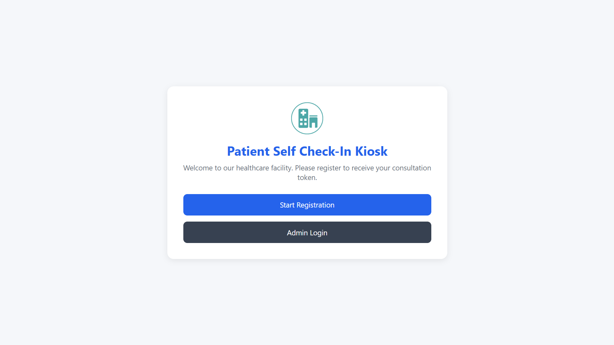
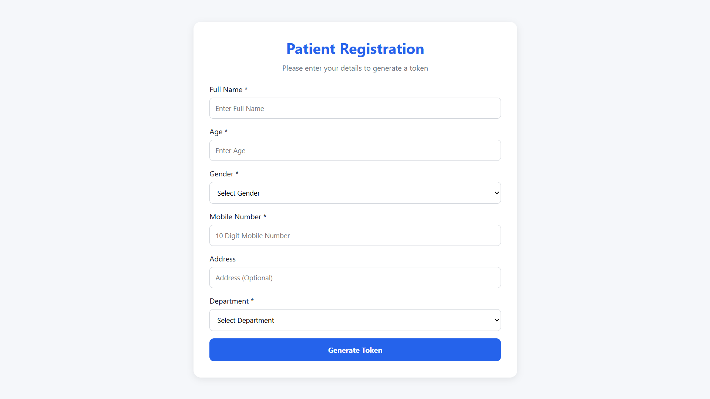
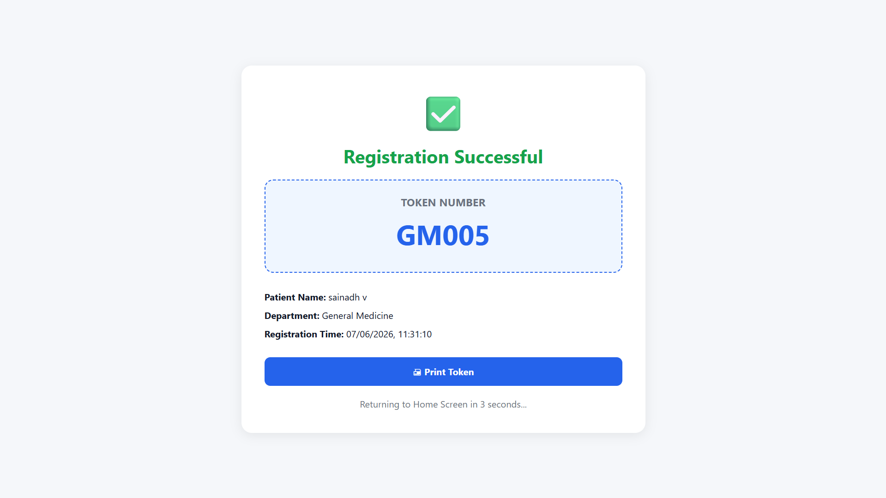
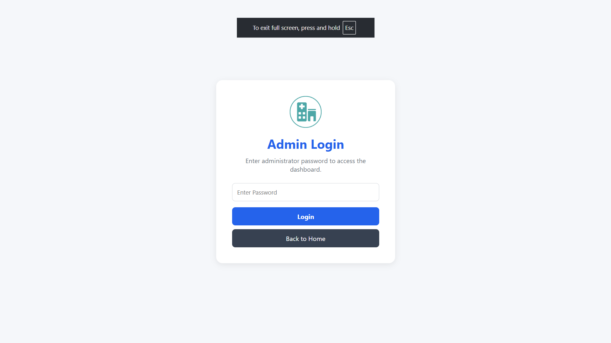
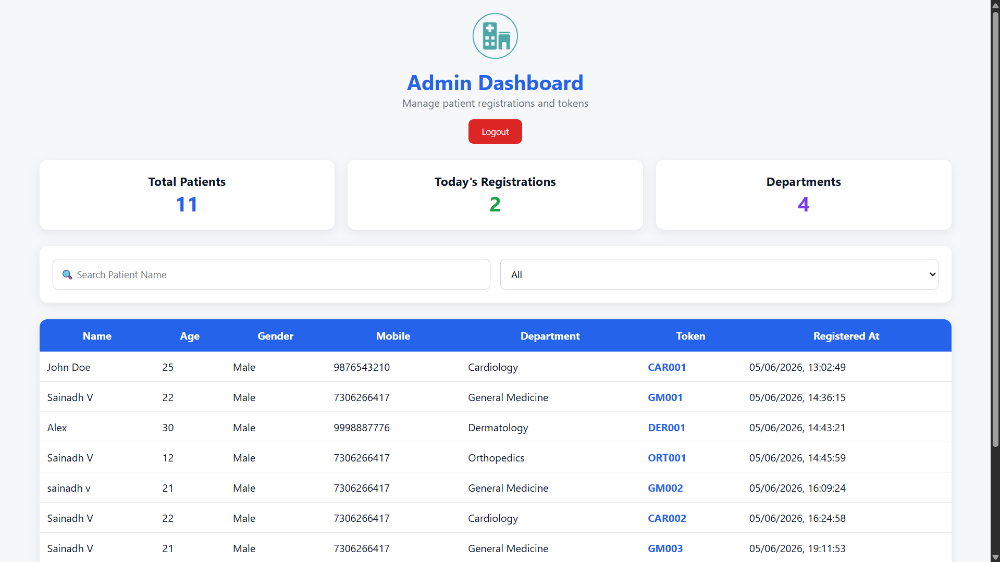

# Patient Self Check-In Kiosk

A healthcare self-service kiosk application built using React, FastAPI, and SQLite.

## Features

### Patient Registration
- Full Name
- Age Validation (1-120)
- Gender Selection
- Mobile Number Validation
- Address Input
- Department Selection

### Token Generation
- Unique department-based token generation
- Registration timestamp
- Printable token
- Automatic return to home screen

### Admin Dashboard
- Protected admin login
- View all registered patients
- Search patients by name
- Filter patients by department
- Total patients statistics
- Today's registrations statistics
- Department count statistics
- Logout functionality

### Validation
- Name required
- Gender required
- Department required
- Age validation (1-120)
- Mobile number validation (10 digits)
- Frontend validation
- Backend validation

## Technology Stack

### Frontend
- React
- React Router
- Axios
- Vite

### Backend
- FastAPI
- SQLAlchemy
- SQLite

## Project Structure

```text
patient-kiosk/
│
├── backend/
│   ├── main.py
│   ├── models.py
│   ├── schemas.py
│   ├── database.py
│   └── patients.db
│
├── frontend/
│   ├── src/
│   │   ├── pages/
│   │   ├── assets/
│   │   ├── services/
│   │   ├── App.jsx
│   │   └── main.jsx
│   │
│   └── package.json
│
├── screenshots/
│
├── README.md
└── .gitignore
```

## Installation

### Backend Setup

```bash
cd backend

python -m venv venv

venv\Scripts\activate

pip install fastapi uvicorn sqlalchemy pydantic

uvicorn main:app --reload
```

Backend URL:

```text
http://127.0.0.1:8000
```

API Documentation:

```text
http://127.0.0.1:8000/docs
```

---

### Frontend Setup

```bash
cd frontend

npm install

npm run dev
```

Frontend URL:

```text
http://localhost:5173
```

---

## API Endpoints

### Create Patient

```http
POST /api/patients
```

### Get All Patients

```http
GET /api/patients
```

### Search Patients

```http
GET /api/patients?search=<patient_name>
```

### Get Patient By ID

```http
GET /api/patients/{id}
```

---

## Admin Login

Default Admin Password:

```text
admin123
```

---

## Screenshots

 `screenshots`

```md









```

---

## Bonus Features

- Admin Login Protection
- Route Guard for Admin Dashboard
- Logout Functionality
- Responsive UI
- Dashboard Statistics
- Printable Token

